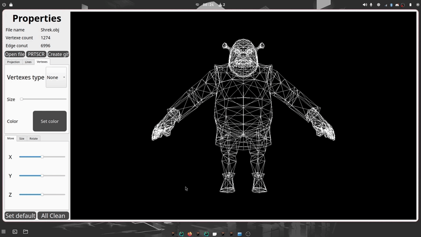

# 3DViewer v2.0

## Description

#### Program for Visualizing a Wireframe Model in 3D Space

- The program is developed in C++ using the C++17 standard.
- The source code is located in the `src` directory.
- The code follows the Google coding style.
- The build process uses a Makefile with standard targets: `all`, `install`, `uninstall`, `clean`, `dvi`, `dist`, and `tests`.

### Features

1. **Software Architecture**:
    - The program follows the principles of object-oriented programming (OOP).
    - It uses the Model-View-Controller (MVC) design pattern.
    - The code is divided into modules for business logic (models), visual representation (views), and controllers.

2. **Functionality**:
    - Load wireframe models from .obj files that support vertex and face lists.
    - Translate the model by a specified distance along the X, Y, and Z axes.
    - Rotate the model by a specified angle around its X, Y, and Z axes.
    - Scale the model by a specified factor.


### Additional Settings

1. **Projection Type and Display Parameters**:
    - The program supports both parallel and central projection types.
    - Users can configure the type of edges and vertex display.

2. **Appearance Settings**:
    - Choose the background color.
    - Set the color and size of the vertices.
    - Set the color and thickness of the edges.

3. **Saving Settings**:
    - Settings are preserved between program restarts.


### Additional Functionality - Recording

1. **Saving Images**:
    - Save model images in BMP and JPEG formats.

2. **Creating GIFs**:
    - Record user-defined affine transformations of the loaded object into a GIF animation (10fps, 5s).



## System Requirements

- Operating System: Linux or macOS
- C++17 compiler, CMake (version 3.22 or higher)
- GUI library with C++17 API (Qt)
- GTest library (for unit tests)

## Project Structure

- `src/model/` - library code with business logic
- `src/controller/` - controller code
- `src/view/` - GUI code
- `src/tests` - unit tests for libraries (GTest)
- `src/Makefile` - project build file

## Usage

Run the program:
```bash
cd ../src
make
```